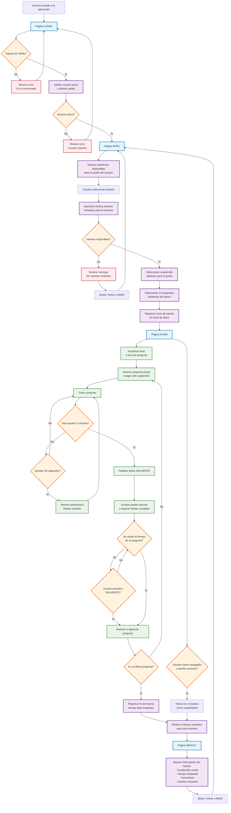

# Arquitectura del Portal de Evaluación Académica IEM

## Visión General
Sistema web para evaluaciones académicas que permite a estudiantes realizar pruebas en diferentes áreas del conocimiento con autenticación por código estudiantil.

## Arquitectura del Sistema

### Frontend
- **Tecnología**: HTML5, CSS3, JavaScript (Vanilla)
- **Estructura**:
  - `index.html`: Página de login
  - `frontend/pages/`: Páginas de la aplicación
  - `frontend/js/`: Scripts de validación y funcionalidad
  - `frontend/css/`: Estilos responsivos
  - `frontend/images/`: Recursos gráficos

### Backend
- **Tecnología**: Python + Flask
- **Puerto**: 5000
- **Funcionalidades**:
  - Autenticación de usuarios
  - Gestión de exámenes
  - Almacenamiento de resultados
  - API REST para frontend

### Base de Datos
- **Tipo**: Base de datos relacional **SQLite** gestionada con **Flask-SQLAlchemy**.
- **Archivos de Semilla (Seeding)**: Los datos iniciales se cargan desde archivos JSON ubicados en `backend/data/`.
  - `usuarios.json`: Define los usuarios iniciales.
  - `cuadernillos.json`: Define las propiedades de los cuadernillos estáticos.
  - `examenes.json`: Define los exámenes que se presentan a los usuarios.

## Estructura de Datos

La estructura de datos principal ahora reside en los modelos de SQLAlchemy. Los siguientes ejemplos de JSON muestran el formato utilizado para el seeding de la base de datos.

### usuarios.json
```json
[
  {
    "codigo": "IEM0601",
    "nombre_completo": "Ana María García",
    "grado": "6",
    "activo": true,
    "role": "USER"
  }
]
```

### cuadernillos.json
```json
{
  "matematicas": {
    "descripcion": "Evaluación de conceptos matemáticos básicos",
    "activo": true,
    "cuadernillos_disponibles": [
      {
        "grado": "6",
        "cuadernillo_id": "mat_6_cuad_01",
        "dir_banco": "/data/sexto/matematicas/",
        "total_preguntas_banco": 20
      }
    ]
  }
}
```

### examenes.json
```json
{
  "matematicas_grado_6": {
    "nombre": "Cuadernillo de Matemáticas - Grado 6",
    "descripcion": "Lee las preguntas de las imágenes y responde.",
    "activo": true,
    "grado": "6",
    "area": "matematicas",
    "cuadernillo_id": "mat_6_cuad_01"
  }
}
```

## Flujo de la Aplicación



## APIs del Backend

### Autenticación
- `POST /api/validar` - Validar código estudiantil
- `POST /api/logout` - Cerrar sesión

### Exámenes
- `GET /api/examenes` - Listar áreas disponibles
- `GET /api/examenes/:area` - Obtener examen específico
- `POST /api/examenes/:area/iniciar` - Iniciar examen
- `POST /api/examenes/:area/responder` - Enviar respuesta
- `POST /api/examenes/:area/finalizar` - Finalizar examen

### Resultados
- `GET /api/resultados/:codigo` - Historial del estudiante
- `GET /api/resultados/:codigo/:area` - Resultados por área

## Seguridad
- Validación de formato de código estudiantil
- Verificación de usuario activo
- Tiempo límite por examen
- Prevención de múltiples intentos simultáneos

## Características Técnicas
- Diseño responsivo (mobile-first)
- Almacenamiento local para sesión
- Manejo de errores robusto
- Interfaz intuitiva y accesible

